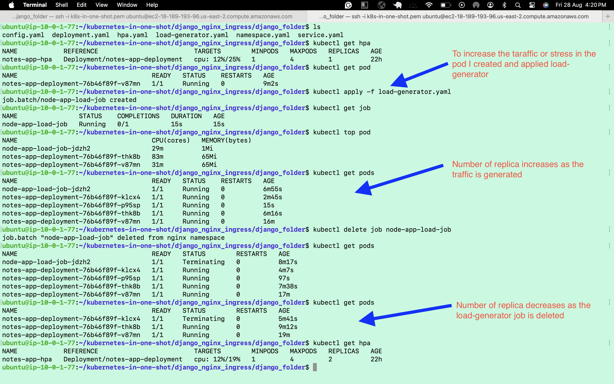

# Django Horizontal Pod Autoscaling (HPA)

## Quick Demo



The screenshot shows: CPU load triggers scale-up (1→4 replicas), then scale-down when load stops.

---

## What This Does

Automatically scales Django app pods up/down based on CPU usage in Kubernetes.

**Setup:**
- 1-4 pod replicas
- Scales at 19% CPU threshold
- Auto-scales down with 1s cooldown

---

## Prerequisites

### Metrics Server ✅
Already installed. Verify:
```bash
kubectl apply -f https://github.com/kubernetes-sigs/metrics-server/releases/download/v0.6.1/components.yaml

# Add kubelet-insecure-tls flag
kubectl -n kube-system edit deployment metrics-server
# Add: - --kubelet-insecure-tls

kubectl -n kube-system rollout restart deployment metrics-server

# Check metrics work
kubectl top nodes
kubectl top pods -A
```

---

## Deploy in 5 Steps

```bash
# 1. Create cluster
kind create cluster --config config.yaml --name django-hpa

# 2. Create namespace
kubectl apply -f namespace.yaml

# 3. Deploy app
kubectl apply -f deployment.yaml

# 4. Create service
kubectl apply -f service.yaml

# 5. Enable autoscaling
kubectl apply -f hpa.yaml
```

---

## Watch Autoscaling

**Terminal 1 - Monitor HPA:**
```bash
kubectl get hpa -n nginx --watch
```

**Terminal 2 - Watch pods scale:**
```bash
kubectl get pods -n nginx --watch
```

**Terminal 3 - Generate load:**
```bash
kubectl apply -f load-generator.yaml
# Watch replicas: 1 → 4 (as CPU increases)

# Stop and watch scale-down
kubectl delete job node-app-load-job -n nginx
# Watch replicas: 4 → 1 (as load stops)
```

---

## Configuration

**Deployment** (`deployment.yaml`):
- CPU request: 100m, limit: 200m
- Memory: 128Mi request, 256Mi limit

**HPA** (`hpa.yaml`):
- Min replicas: 1
- Max replicas: 4
- Target CPU: 19%
- Scale-down: 1 pod/second

**Load Generator** (`load-generator.yaml`):
- Busybox job with wget loop
- ~10 requests/second to trigger scaling

---

## Useful Commands

```bash
# HPA status
kubectl describe hpa notes-app-hpa -n nginx

# Check metrics
kubectl top pods -n nginx

# View HPA events
kubectl get events -n nginx --sort-by='.lastTimestamp'

# Cleanup
kubectl delete namespace nginx
kind delete cluster --name django-hpa
```

---

## Key Metrics Flow

Metrics Server → HPA Controller → (CPU > 19%?) → Scale Up  
↑ (every 15 seconds)

---

## Troubleshooting

**HPA shows "unknown"?**
```bash
kubectl logs -n kube-system -l k8s-app=metrics-server
# Ensure metrics-server is running and has --kubelet-insecure-tls flag
```

**Pods not scaling?**
```bash
# 1. Check load job is running
kubectl get job -n nginx

# 2. Check metrics collection
kubectl top pods -n nginx

# 3. Wait ~1-2 minutes for metrics baseline
```

---

**Author:** Sagar Pyakurel  
**Repo:** Django-project_Horizontal_Pod_Autoscale-HPA-
